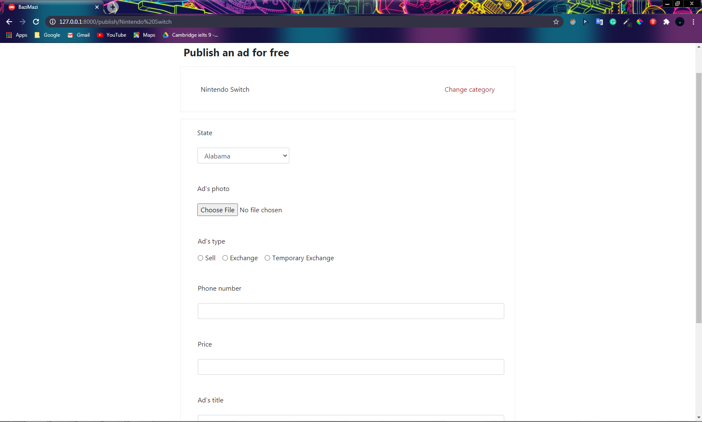

# BaziMazi

**This website is about trading or exchanging video games and the things related to gaming (e.g. consoles) by publishing ads.**

First of all, we need 2 packages names as Django (the framework for writing web projects using python) and Pillow (for uploading images in our database). They are included in requirements.txt. So be sure to install the requirements before running the application by using this command --> ```pip3 install -r requirements.txt```

*index.html* contains all of the things on the landing page like navbar, left navbar, the main body that includes all of the ads, and a search box. It also includes all of the javascript and ajax code for filtering ads.


***

If you click on one of the ads the *ad.html* file will open. It contains the ad's image and description. There are 3 buttons on this page: Save button (which saves the ad for you), Chat button (it opens a chat room with the publisher of the ad), and the Call Information button which shows you the phone number of the publisher.


***

There is a button on the right side of the navbar that is linked to the *publish-ad.html*. You can publish your ad on this page. First, you have to choose which category your ad is about and then you can write a description of your ad, add an image, choose your state, and... and then you can publish the ad and it will be shown to all the users.




***

There are two links in the navbar. One of them is my ads that will take you to the *my-ads.html* page you can see the ads that you have published and if you haven't signed in yet there is a sign in button.This page has three tabs(my-ads, history and saved ads) that each one of them takes you to another page. 


***

The other link in the navbar will take you to the chat part where you can chat with someone who wants to purchase one of your ads or you can contact the other as a 
purchaser. But it isn't compeleted and I will add it as a new feature when my website is finished. 


***

You might have noticed that there is a navbar on the left side of the page. This navbar is for filtering and it has two parts. The first one is the category part and you can filter the ads by their category. The next part is about filtering by price and image. There is also another button on the top navbar for filtering by region.


***

The website is compeletely responsive and if you inspect it on the small size devices you can see that the left nav will be converted to two buttons. And 
the other pages would change their sizes automatically.


***

** Watch all of my CS50's Web Programming with Python and JavaScript projects videos here: **  https://www.youtube.com/watch?v=taz8kCE_kBs&list=PLMmG0ZlUCOZLE9nKuDH0uvbppuA_ByOuM
